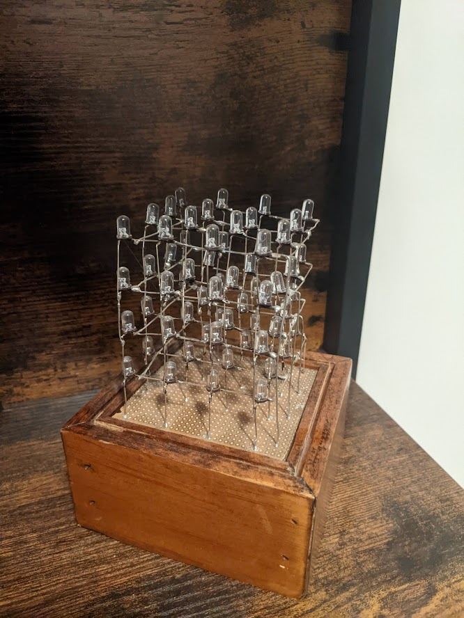
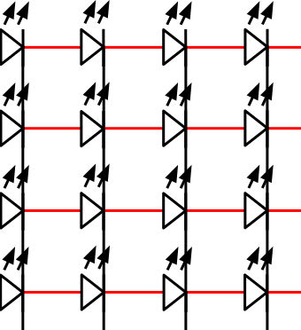

<!-- Header -->

   
  
  <!-- Logo -->
  

  <!-- Title -->
  ### Animated Cube
  
  <!-- Description -->
  Animated 4x4x4 LED cube

  <!-- Repo badges -->
  
  
  

  <!-- Links -->

  ---
  

    <a href="https://git.zakscode.com/ztimson/animated-cube/releases" target="_blank">Release Notes</a>
    • <a href="https://git.zakscode.com/ztimson/animated-cube/issues/new?template=.github%2fissue_template%2fbug.md" target="_blank">Report a Bug</a>
    • <a href="https://git.zakscode.com/ztimson/animated-cube/issues/new?template=.github%2fissue_template%2fenhancement.md" target="_blank">Request a Feature</a>
  

  ---

## Table of Contents
- [Animated Cube](#top)
  - [About](#about)
    - [Demo](#demo)
    - [Built With](#built-with)
  - [License](#license)

## About

 
 

This repo contains code for running a 4x4x4 (64 total) LED cube. It uses [multiplexing](https://en.wikipedia.org/wiki/Multiplexing) to control all 64 LEDs using only 20 inputs (4 layers + 16 columns).

4 LED's are wired into columns using their annode. 16 columns are then wired together in a 4x4 square creating a cube. Each vetical layer has its 16 LED cathodes wired together into a plane. By keeping all inputs disconnected, individual LED's can be turned on by connecting the desired column & layer to the positive and negative respectively providing only one complete path for the electricy to follow. Multiple LEDs can be turned on at once by individually blinking each LED faster than the eye can see. By doing this to render multiple "frames" small animations can be created.

Animations are run using an [Arduino Nano](https://store.arduino.cc/products/arduino-nano).

### Demo

Video of what it looks like: https://www.youtube.com/watch?v=4pzxR-ZhbJA

<ins>**Disclaimer:** I did not create the video but it is made using the same idea</ins>

### Built With

## License
Copyright © 2023 Zakary Timson | Available under MIT Licensing

See the [license](./LICENSE) for more information.
