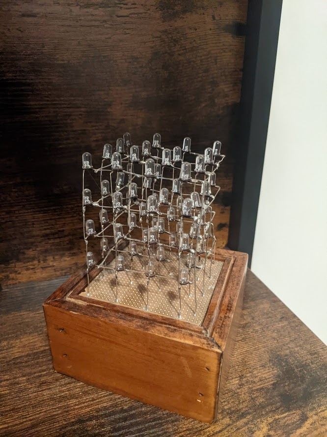

# Animated Cube
Using multiplexing, I created a 3D cube of blue LED's 4x4x4. It's powered by an Arduino
allowing me to create animations by turning on multiple lights.

## Table of Contents
[[_TOC_]]

## Gallery

